# Polymer Translocation Through Nanopores: Simulation & Modeling

This repository contains the numerical simulations 
developed as part of a research project on **polymer translocation through nanopores**. 
The project explores the scaling laws of translocation times,
comparing theoretical models from polymer physics with numerical results.

| Polymer Escape Animations | Polymer Translocation Animations |
|---------------------------|----------------------------------|
| 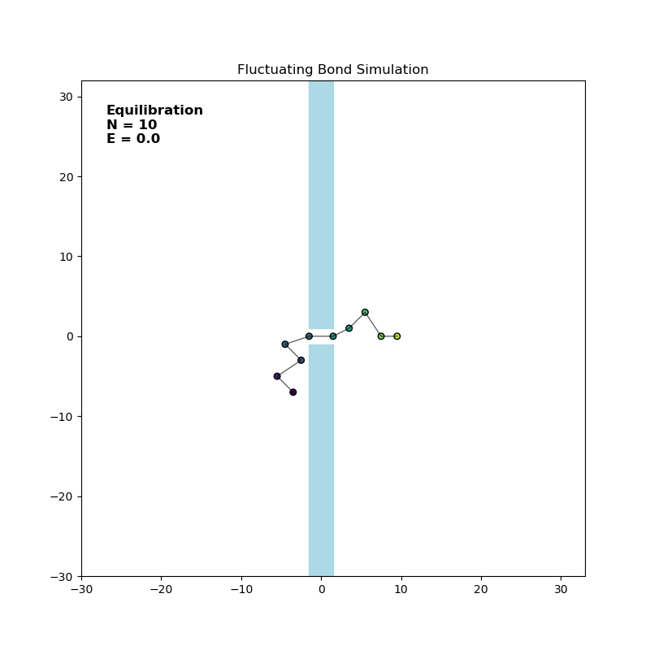 | 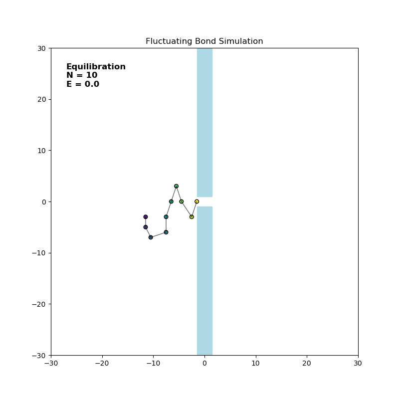 |
| 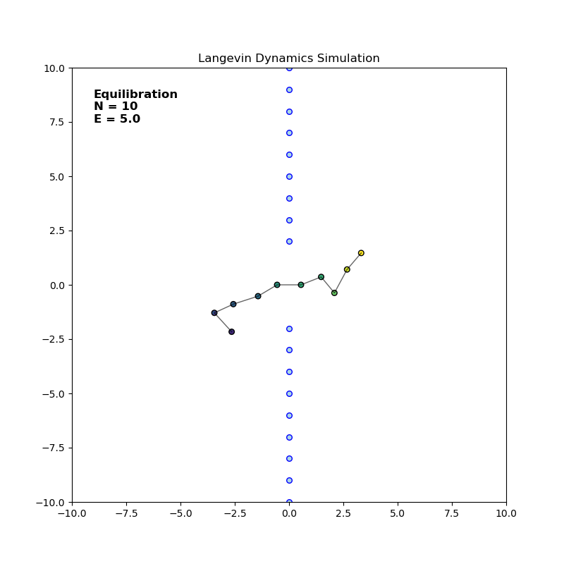 | 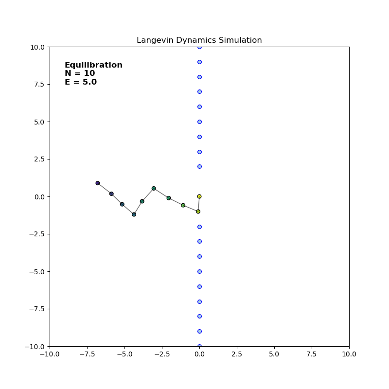 |

## Overview

Polymer translocation is a highly non-equilibrium biological process where a macromolecule
(like DNA, RNA, or proteins) is transported through a membrane-embedded channel (nanopore).
This phenomenon is critical for understanding biological functions such as
viral DNA injection and protein transport, and it holds massive potential for
biotechnology applications for example in DNA sequencing or targeted drug delivery.

The simulations focuse on the translocation dynamics of a polymer 
crossing from the *cis* side to the *trans* side of a membrane,
particularly analyzing how the translocation time $\tau$ 
scales with the polymer chain length $N$ ($\tau \sim N^\alpha$) 
under different conditions such as absence or presence of external electrical field,
different solution temperature and so on.

## Theoretical Background & Models

The repository implements two distinct numerical approaches:

### 1. Fluctuating Bond Model (FBM)
A lattice-based Monte Carlo approach where monomers occupy lattice sites,
and the bond lengths between consecutive monomers are allowed to fluctuate within a restricted set of allowed lengths
to prevent chain crossing and maintain excluded volume conditions.

Based on these original paper:
* Kaifu Luo et. al. _„Polymer translocation through a nanopore under an applied
external field”_. In: The Journal of Chemical Physics 124.11 (march 2006.), page 114704.
issn: 0021-9606. doi: 10.1063/1.2179792. url: https://doi.org/10.1063/1.2179792.
* Kaifu Luo, T. Ala-Nissila и See-Chen Ying. _„Polymer translocation through a
nanopore: A two-dimensional Monte Carlo study”_. In: The Journal of Chemical
Physics 124.3 (january 2006.), page 034714. issn: 0021-9606. doi: 10.1063/1.2161189.
url: https://doi.org/10.1063/1.2161189.

### 2. Langevin Dynamics Simulation (LD)
An off-lattice, continuous space model that solves the stochastic Langevin equation of motion 
for each monomer bead in a "bead-spring" configuration. 
Includes Lennard-Jones repulsive force to model excluded volume interaction and
Finite Extension Nonlinear Elastic force to model bond between monomers.

Based on this original paper:
* Ilkka Huopaniemi и et. al. _„Langevin dynamics simulations of polymer translocation
through nanopores”_. In: The Journal of Chemical Physics 125.12 (september 2006.),
page 124901. issn: 0021-9606. doi: 10.1063/1.2357118. 
url: https://doi.org/10.1063/1.2357118

## Key Parameters Investigated

* **Escape time:** average time needed for a polymer
whose middle monomer is initially located in the middle of the pore
to escape the pore to the either side of the membrane 
(used in the case of zero external field to avoid unphysical assumptions).
Lower theoretical limit for real polymers in 2D is $\alpha = 2.5$.
* **Translocation time:** average time needed for a polymer
whose first monomer is initially located at the pore entrance
to translocate through the pore to the other side of the membrane.
Lower theoretical limit for real polymers in 2D:
  * $\alpha = 1.5$ for short chains,
  * $\alpha = 1.75$ for long chains.
* **Waiting times:** the time duration between the
events when monomers m and m+1 exit the pore.
This distribution should be symmetrical for shorter polymers, 
but asymmetrical (biased to higher monomer numbers) for longer polymers.

## Features

* [FluctuatingBondSimulation.py](src/FluctuatingBondSimulation.py) - Implements class
for simulating polymer translocation using Fluctuating Bond model.
* [LangevinDynamics.py](src/LangevinDynamicsSimulation.py) - Implements class
for simulating polymer translocation using Langevin Dynamics model.
* [Paralelization.py](src/Paralelization.py) - Implements class for concurrently running
polymer translocation simulations on desired number of processes.
* [Analysis.py](src/Analysis.py) - Contains functions for analysis of acquired simulation data.

Additional scripts found in folder [tests](tests/) demonstrate the use of functions.

## Data Analysis Features

* Escape/Translocation times histograms (PDF or not, normalized to mean time or not)

| Example: Escape                                         | Example: Translocation                                         |
|---------------------------------------------------------|----------------------------------------------------------------|
| 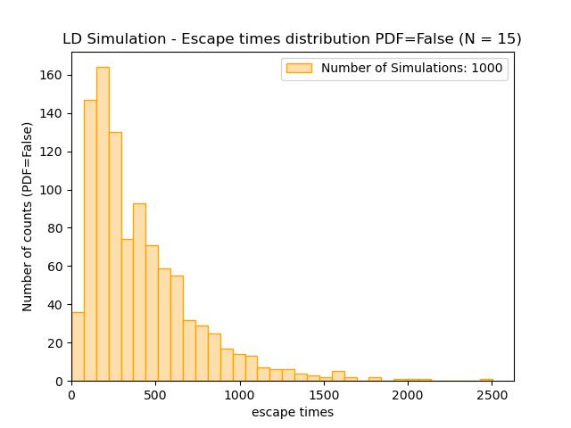 | 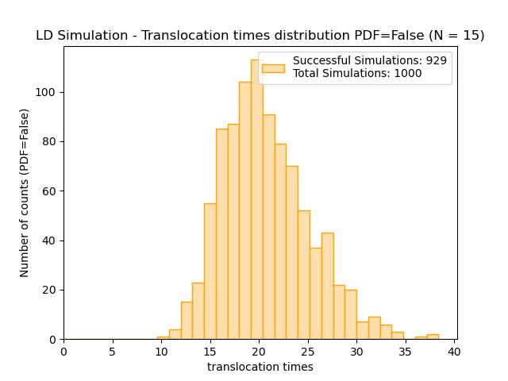 |

* Comparisson between escape/translocation time histograms for the two simulations

| Example: Escape                                       | Example: Translocation                                       |
|-------------------------------------------------------|--------------------------------------------------------------|
| 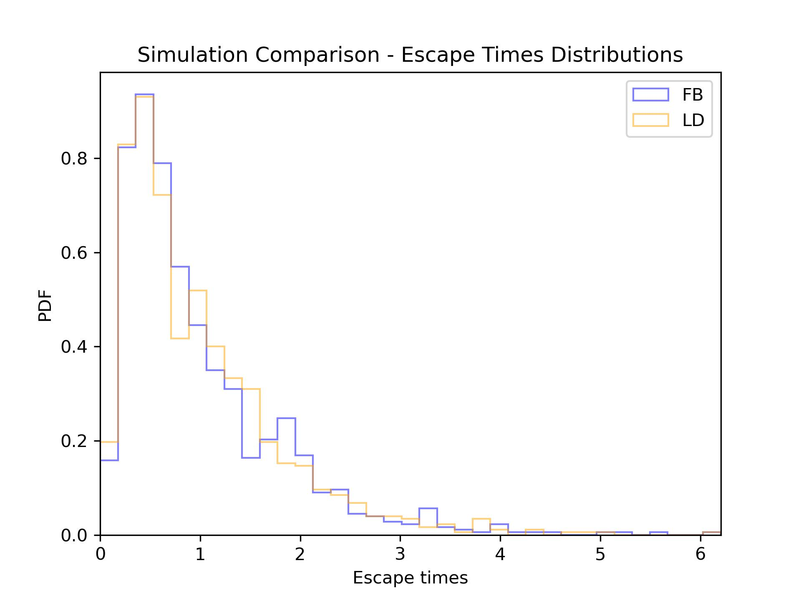 | 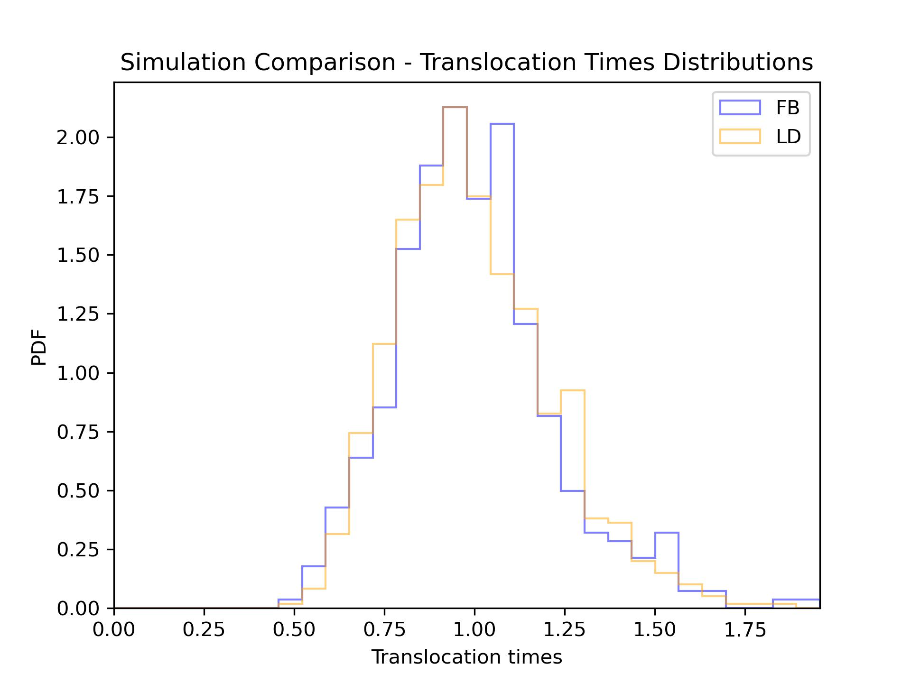 |

* Collapse of histograms for one simulation but for different number of monomers in a polymer
  (either as plain histogram or a PDF estimated using seaborn KDE)

| Example: Histograms                                | Example: KDE                                 |
|----------------------------------------------------|----------------------------------------------|
| 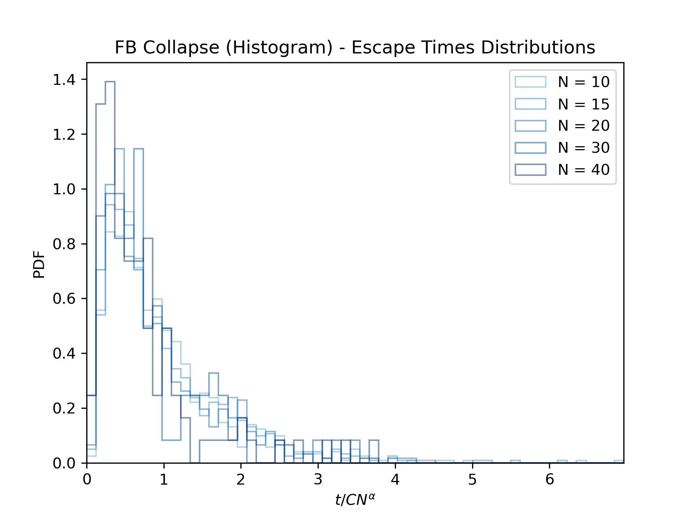 | 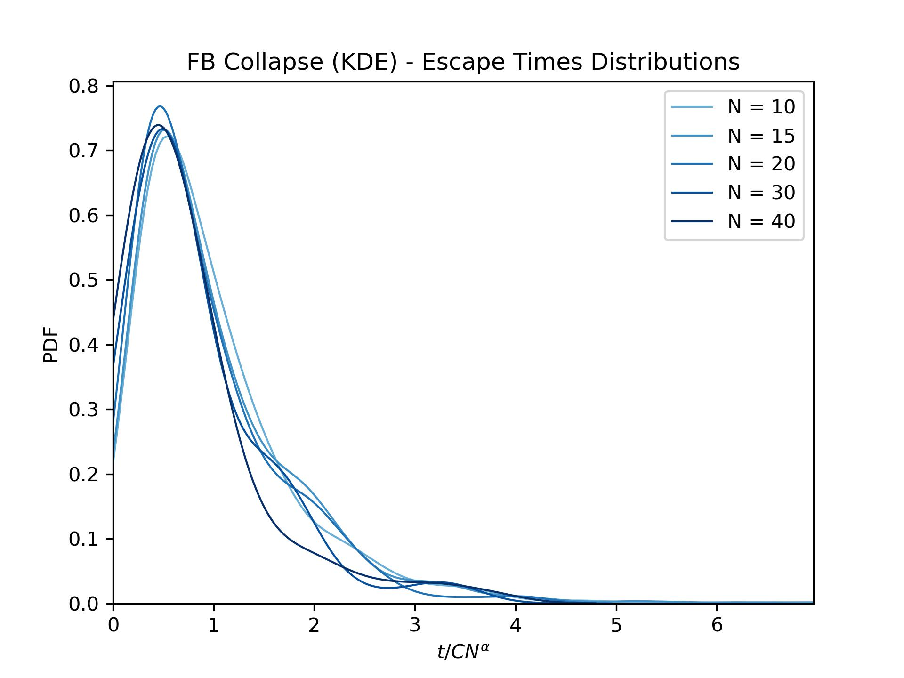 |

* Fit for deriving universal escape/translocation time scaling 
* (for each model separately as well as fit comparison)

| Example: Escape                         | Example: Translocation                         |
|-----------------------------------------|------------------------------------------------|
| 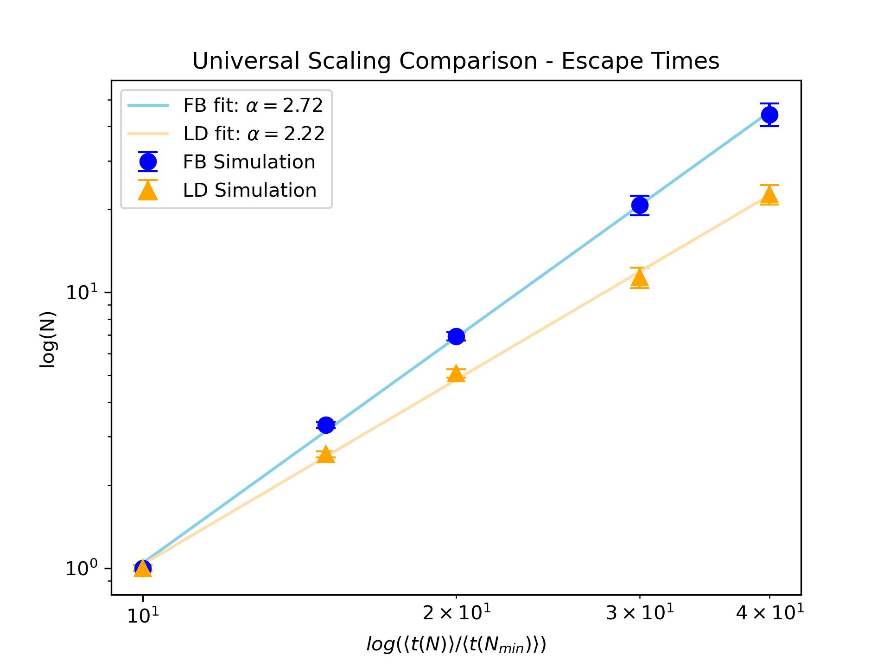 | 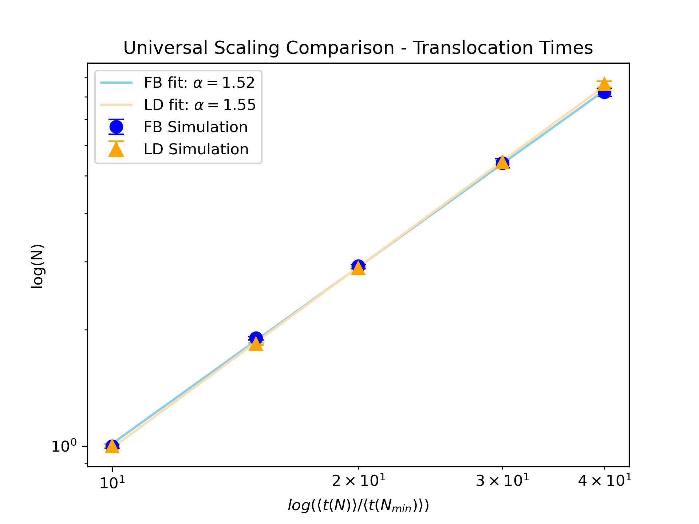 |

* Waiting times for each monomer in polymer chain

| Example: FB                         | Example: LD                         |
|-------------------------------------|-------------------------------------|
| 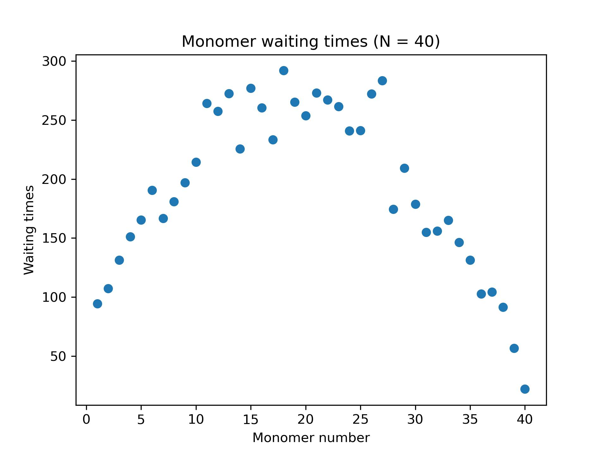 | 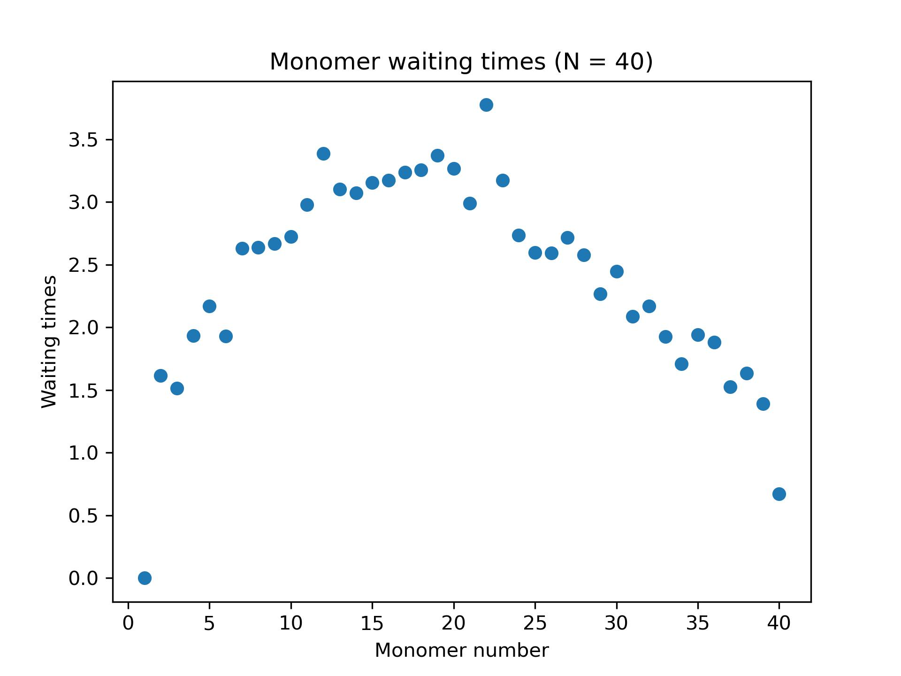 |

### Prerequisites

All packages necessary to run these scripts are listed in [requirements.txt](requirements.txt)
